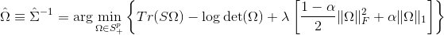

```{r setup, include=FALSE}
knitr::opts_chunk$set(echo = TRUE)
```


See [vignette](https://mgallow.github.io/ADMMsigma/) or [manual](https://github.com/MGallow/ADMMsigma/blob/master/ADMMsigma.pdf).

## Overview

<br>\vspace{0.5cm}

<p align="center">
  
</p>

<br>\vspace{0.5cm}


`ADMMsigma` is an R package that estimates a penalized precision matrix via the alternating direction method of multipliers (ADMM) algorithm. It currently supports a general elastic-net penalty that allows for both ridge and lasso-type penalties as special cases. A (possibly incomplete) list of functions contained in the package can be found below:

* `ADMMsigma()` computes the estimated precision matrix (ridge, lasso, and elastic-net type regularization optional)

* `RIDGEsigma()` computes the estimated ridge penalized precision matrix via closed-form solution

* `plot.ADMMsigma()` produces a heat map for cross validation errors

* `plot.RIDGEsigma()` produces a heat map for cross validation errors


## Installation

```{r, eval = FALSE}
# The easiest way to install is from CRAN
install.packages("ADMMsigma")

# You can also install the development version from GitHub:
# install.packages("devtools")
devtools::install_github("MGallow/ADMMsigma")
```

If there are any issues/bugs, please let me know: [github](https://github.com/MGallow/ADMMsigma/issues). You can also contact me via my [website](http://users.stat.umn.edu/~gall0441/). Pull requests are welcome!

## Usage

```{r, message = FALSE}
library(ADMMsigma)

# generate data from a sparse matrix
# first compute covariance matrix
S = matrix(0.7, nrow = 5, ncol = 5)
for (i in 1:5){
  for (j in 1:5){
    S[i, j] = S[i, j]^abs(i - j)
  }
}

# print oracle precision matrix (shrinkage might be useful)
(Omega = qr.solve(S) %>% round(3))

# generate 1000 x 5 matrix with rows drawn from iid N_p(0, S)
Z = matrix(rnorm(1000*5), nrow = 1000, ncol = 5)
out = eigen(S, symmetric = TRUE)
S.sqrt = out$vectors %*% diag(out$values^0.5) %*% t(out$vectors)
X = Z %*% S.sqrt


# print sample precision matrix (perhaps a bad estimate)
(qr.solve(cov(X)) %>% round(5))

# elastic-net type penalty (set tolerance to 1e-8)
ADMMsigma(X, tol1 = 1e-8, tol2 = 1e-8)

# lasso penalty (default tolerance)
ADMMsigma(X, alpha = 1)

# elastic-net penalty (alpha = 0.5)
ADMMsigma(X, alpha = 0.5)

# ridge penalty
ADMMsigma(X, alpha = 0)

# ridge penalty no ADMM
RIDGEsigma(X, lam = 10^seq(-8, 8, 0.01))

# produce CV heat map for ADMMsigma
ADMMsigma(X, tol1 = 1e-8, tol2 = 1e-8) %>% plot

# produce CV heat map for RIDGEsigma
RIDGEsigma(X, lam = 10^seq(-8, 8, 0.01)) %>% plot

```
