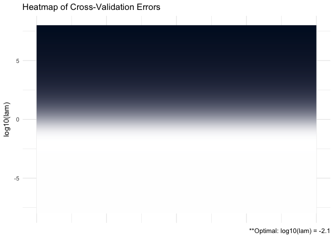

ADMMsigma
================

See [vignette](https://mgallow.github.io/ADMMsigma/) or [manual](https://github.com/MGallow/ADMMsigma/blob/master/ADMMsigma.pdf).

Overview
--------

<br>

<p align="center">

</p>
<br>

`ADMMsigma` is an R package that estimates a penalized precision matrix via the alternating direction method of multipliers (ADMM) algorithm. It currently supports a general elastic-net penalty that allows for both ridge and lasso-type penalties as special cases. A (possibly incomplete) list of functions contained in the package can be found below:

-   `ADMMsigma()` computes the estimated precision matrix (ridge, lasso, and elastic-net type regularization optional)

-   `RIDGEsigma()` computes the estimated ridge penalized precision matrix via closed-form solution

-   `plot.ADMMsigma()` produces a heat map or line graph for cross validation errors

-   `plot.RIDGEsigma()` produces a heat map or line graph for cross validation errors

Installation
------------

``` r
# The easiest way to install is from CRAN
install.packages("ADMMsigma")

# You can also install the development version from GitHub:
# install.packages("devtools")
devtools::install_github("MGallow/ADMMsigma")
```

If there are any issues/bugs, please let me know: [github](https://github.com/MGallow/ADMMsigma/issues). You can also contact me via my [website](http://users.stat.umn.edu/~gall0441/). Pull requests are welcome!

Usage
-----

``` r
library(ADMMsigma)

# generate data from a sparse matrix
# first compute covariance matrix
S = matrix(0.7, nrow = 5, ncol = 5)
for (i in 1:5){
  for (j in 1:5){
    S[i, j] = S[i, j]^abs(i - j)
  }
}

# print oracle precision matrix (shrinkage might be useful)
(Omega = qr.solve(S) %>% round(3))
```

    ##        [,1]   [,2]   [,3]   [,4]   [,5]
    ## [1,]  1.961 -1.373  0.000  0.000  0.000
    ## [2,] -1.373  2.922 -1.373  0.000  0.000
    ## [3,]  0.000 -1.373  2.922 -1.373  0.000
    ## [4,]  0.000  0.000 -1.373  2.922 -1.373
    ## [5,]  0.000  0.000  0.000 -1.373  1.961

``` r
# generate 1000 x 5 matrix with rows drawn from iid N_p(0, S)
Z = matrix(rnorm(100*5), nrow = 100, ncol = 5)
out = eigen(S, symmetric = TRUE)
S.sqrt = out$vectors %*% diag(out$values^0.5) %*% t(out$vectors)
X = Z %*% S.sqrt


# print sample precision matrix (perhaps a bad estimate)
(qr.solve(cov(X)) %>% round(5))
```

    ##          [,1]     [,2]     [,3]     [,4]     [,5]
    ## [1,]  2.05121 -1.49584 -0.14523  0.26045 -0.19023
    ## [2,] -1.49584  2.73491 -0.87214 -0.55415  0.40914
    ## [3,] -0.14523 -0.87214  2.31357 -1.05951 -0.18131
    ## [4,]  0.26045 -0.55415 -1.05951  2.69115 -1.11630
    ## [5,] -0.19023  0.40914 -0.18131 -1.11630  1.78573

``` r
# elastic-net type penalty (set tolerance to 1e-8)
ADMMsigma(X, tol.abs = 1e-8, tol.rel = 1e-8)
```

    ## 
    ## Call: ADMMsigma(X = X, tol.abs = 1e-08, tol.rel = 1e-08)
    ## 
    ## Iterations: 110
    ## 
    ## Tuning parameters:
    ##       log10(lam)  alpha
    ## [1,]      -1.612      0
    ## 
    ## Log-likelihood: -138.13226
    ## 
    ## Omega:
    ##          [,1]     [,2]     [,3]     [,4]     [,5]
    ## [1,]  1.89373 -1.26005 -0.19347  0.14222 -0.09967
    ## [2,] -1.26005  2.43110 -0.77941 -0.44759  0.28367
    ## [3,] -0.19347 -0.77941  2.18608 -0.93923 -0.21518
    ## [4,]  0.14222 -0.44759 -0.93923  2.45437 -0.96398
    ## [5,] -0.09967  0.28367 -0.21518 -0.96398  1.69966

``` r
# lasso penalty (default tolerance)
ADMMsigma(X, alpha = 1)
```

    ## 
    ## Call: ADMMsigma(X = X, alpha = 1)
    ## 
    ## Iterations: 66
    ## 
    ## Tuning parameters:
    ##       log10(lam)  alpha
    ## [1,]      -1.167      1
    ## 
    ## Log-likelihood: -163.06899
    ## 
    ## Omega:
    ##          [,1]     [,2]     [,3]     [,4]     [,5]
    ## [1,]  1.71264 -1.08411 -0.11721  0.00000  0.00000
    ## [2,] -1.08411  2.11048 -0.68111 -0.19378  0.00000
    ## [3,] -0.11721 -0.68111  1.89983 -0.86238 -0.07087
    ## [4,]  0.00000 -0.19378 -0.86238  2.12371 -0.78640
    ## [5,]  0.00000  0.00000 -0.07087 -0.78640  1.53353

``` r
# elastic-net penalty (alpha = 0.5)
ADMMsigma(X, alpha = 0.5)
```

    ## 
    ## Call: ADMMsigma(X = X, alpha = 0.5)
    ## 
    ## Iterations: 50
    ## 
    ## Tuning parameters:
    ##       log10(lam)  alpha
    ## [1,]      -1.389    0.5
    ## 
    ## Log-likelihood: -147.14312
    ## 
    ## Omega:
    ##          [,1]     [,2]     [,3]     [,4]     [,5]
    ## [1,]  1.81860 -1.16818 -0.15258  0.00000  0.00000
    ## [2,] -1.16818  2.27528 -0.74274 -0.29499  0.12116
    ## [3,] -0.15258 -0.74274  2.06555 -0.89789 -0.16546
    ## [4,]  0.00000 -0.29499 -0.89789  2.31618 -0.88305
    ## [5,]  0.00000  0.12116 -0.16546 -0.88305  1.62764

``` r
# ridge penalty
ADMMsigma(X, alpha = 0)
```

    ## 
    ## Call: ADMMsigma(X = X, alpha = 0)
    ## 
    ## Iterations: 50
    ## 
    ## Tuning parameters:
    ##       log10(lam)  alpha
    ## [1,]      -1.612      0
    ## 
    ## Log-likelihood: -138.13234
    ## 
    ## Omega:
    ##          [,1]     [,2]     [,3]     [,4]     [,5]
    ## [1,]  1.89234 -1.25810 -0.19377  0.14128 -0.09897
    ## [2,] -1.25810  2.42823 -0.77871 -0.44641  0.28270
    ## [3,] -0.19377 -0.77871  2.18514 -0.93849 -0.21535
    ## [4,]  0.14128 -0.44641 -0.93849  2.45234 -0.96291
    ## [5,] -0.09897  0.28270 -0.21535 -0.96291  1.69900

``` r
# ridge penalty no ADMM
RIDGEsigma(X, lam = 10^seq(-8, 8, 0.01))
```

    ## 
    ## Call: RIDGEsigma(X = X, lam = 10^seq(-8, 8, 0.01))
    ## 
    ## Tuning parameter:
    ##       log10(lam)    lam
    ## [1,]       -1.72  0.019
    ## 
    ## Log-likelihood: -159.80699
    ## 
    ## Omega:
    ##          [,1]     [,2]     [,3]     [,4]     [,5]
    ## [1,]  1.76082 -1.13220 -0.18736  0.11910 -0.09328
    ## [2,] -1.13220  2.20492 -0.69619 -0.40086  0.24839
    ## [3,] -0.18736 -0.69619  1.99883 -0.83316 -0.20592
    ## [4,]  0.11910 -0.40086 -0.83316  2.22302 -0.86875
    ## [5,] -0.09328  0.24839 -0.20592 -0.86875  1.60066

``` r
# produce CV heat map for ADMMsigma
ADMM = ADMMsigma(X, lam = 10^seq(-5, 5, 0.1), alpha = seq(0, 1, 0.1))
ADMM %>% plot(type = "heatmap")
```


``` r
# produce line graph for CV errors for ADMMsigma
ADMM %>% plot(type = "line")
```


``` r
# produce CV heat map for RIDGEsigma
RIDGE = RIDGEsigma(X, lam = 10^seq(-8, 8, 0.01))
RIDGE %>% plot
```



``` r
# produce line graph for CV errors for RIDGEsigma
RIDGE %>% plot(type = "line")
```


