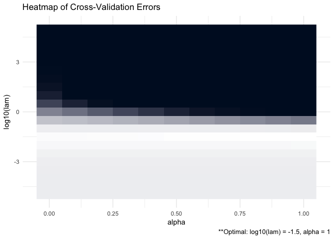

ADMMsigma
================

See [vignette](https://mgallow.github.io/ADMMsigma/) or [manual](https://github.com/MGallow/ADMMsigma/blob/master/ADMMsigma.pdf).

Overview
--------

<br>

<p align="center">

</p>
<br>

`ADMMsigma` is an R package that estimates a penalized precision matrix via the alternating direction method of multipliers (ADMM) algorithm. It currently supports a general elastic-net penalty that allows for both ridge and lasso-type penalties as special cases. A (possibly incomplete) list of functions contained in the package can be found below:

-   `ADMMsigma()` computes the estimated precision matrix (ridge, lasso, and elastic-net type regularization optional)

-   `RIDGEsigma()` computes the estimated ridge penalized precision matrix via closed-form solution

-   `plot.ADMMsigma()` produces a heat map for cross validation errors

-   `plot.RIDGEsigma()` produces a heat map for cross validation errors

Installation
------------

``` r
# The easiest way to install is from CRAN
install.packages("ADMMsigma")

# You can also install the development version from GitHub:
# install.packages("devtools")
devtools::install_github("MGallow/ADMMsigma")
```

If there are any issues/bugs, please let me know: [github](https://github.com/MGallow/ADMMsigma/issues). You can also contact me via my [website](http://users.stat.umn.edu/~gall0441/). Pull requests are welcome!

Usage
-----

``` r
library(ADMMsigma)

# generate data from a sparse matrix
# first compute covariance matrix
S = matrix(0.7, nrow = 5, ncol = 5)
for (i in 1:5){
  for (j in 1:5){
    S[i, j] = S[i, j]^abs(i - j)
  }
}

# print oracle precision matrix (shrinkage might be useful)
(Omega = qr.solve(S) %>% round(3))
```

    ##        [,1]   [,2]   [,3]   [,4]   [,5]
    ## [1,]  1.961 -1.373  0.000  0.000  0.000
    ## [2,] -1.373  2.922 -1.373  0.000  0.000
    ## [3,]  0.000 -1.373  2.922 -1.373  0.000
    ## [4,]  0.000  0.000 -1.373  2.922 -1.373
    ## [5,]  0.000  0.000  0.000 -1.373  1.961

``` r
# generate 1000 x 5 matrix with rows drawn from iid N_p(0, S)
Z = matrix(rnorm(1000*5), nrow = 1000, ncol = 5)
out = eigen(S, symmetric = TRUE)
S.sqrt = out$vectors %*% diag(out$values^0.5) %*% t(out$vectors)
X = Z %*% S.sqrt


# print sample precision matrix (perhaps a bad estimate)
(qr.solve(cov(X)) %>% round(5))
```

    ##          [,1]     [,2]     [,3]     [,4]     [,5]
    ## [1,]  1.93708 -1.31699  0.02351 -0.04895 -0.00987
    ## [2,] -1.31699  2.80451 -1.32455 -0.06593  0.06654
    ## [3,]  0.02351 -1.32455  2.78686 -1.28842  0.01382
    ## [4,] -0.04895 -0.06593 -1.28842  2.93945 -1.42020
    ## [5,] -0.00987  0.06654  0.01382 -1.42020  2.00011

``` r
# elastic-net type penalty (set tolerance to 1e-8)
ADMMsigma(X, tol1 = 1e-8, tol2 = 1e-8)
```

    ## 
    ## Iterations:
    ## [1] 45
    ## 
    ## Tuning parameters:
    ##       log10(lam)  alpha
    ## [1,]        -2.5      1
    ## 
    ## Omega:
    ##          [,1]     [,2]     [,3]     [,4]     [,5]
    ## [1,]  1.90595 -1.27325  0.00000 -0.04804  0.00000
    ## [2,] -1.27325  2.72850 -1.27247 -0.06339  0.04437
    ## [3,]  0.00000 -1.27247  2.72080 -1.24209  0.00000
    ## [4,] -0.04804 -0.06339 -1.24209  2.85250 -1.36774
    ## [5,]  0.00000  0.04437  0.00000 -1.36774  1.96479

``` r
# lasso penalty (default tolerance)
ADMMsigma(X, alpha = 1)
```

    ## 
    ## Iterations:
    ## [1] 18
    ## 
    ## Tuning parameters:
    ##       log10(lam)  alpha
    ## [1,]        -2.5      1
    ## 
    ## Omega:
    ##          [,1]     [,2]     [,3]     [,4]     [,5]
    ## [1,]  1.90622 -1.27345  0.00018 -0.04844 -0.00006
    ## [2,] -1.27345  2.72829 -1.27222 -0.06268  0.04401
    ## [3,]  0.00018 -1.27222  2.72024 -1.24233  0.00012
    ## [4,] -0.04844 -0.06268 -1.24233  2.85307 -1.36811
    ## [5,] -0.00006  0.04401  0.00012 -1.36811  1.96520

``` r
# elastic-net penalty (alpha = 0.5)
ADMMsigma(X, alpha = 0.5)
```

    ## 
    ## Iterations:
    ## [1] 17
    ## 
    ## Tuning parameters:
    ##       log10(lam)  alpha
    ## [1,]          -3    0.5
    ## 
    ## Omega:
    ##          [,1]     [,2]     [,3]     [,4]     [,5]
    ## [1,]  1.92406 -1.29533  0.00882 -0.04646 -0.00698
    ## [2,] -1.29533  2.76655 -1.29526 -0.07370  0.06384
    ## [3,]  0.00882 -1.29526  2.75240 -1.26056  0.00183
    ## [4,] -0.04646 -0.07370 -1.26056  2.89833 -1.39596
    ## [5,] -0.00698  0.06384  0.00183 -1.39596  1.98517

``` r
# ridge penalty
ADMMsigma(X, alpha = 0)
```

    ## 
    ## Iterations:
    ## [1] 15
    ## 
    ## Tuning parameters:
    ##       log10(lam)  alpha
    ## [1,]          -3      0
    ## 
    ## Omega:
    ##          [,1]     [,2]     [,3]     [,4]     [,5]
    ## [1,]  1.92019 -1.29106  0.00933 -0.04586 -0.00980
    ## [2,] -1.29106  2.75756 -1.28813 -0.07900  0.06737
    ## [3,]  0.00933 -1.28813  2.73874 -1.25109 -0.00009
    ## [4,] -0.04586 -0.07900 -1.25109  2.88672 -1.39009
    ## [5,] -0.00980  0.06737 -0.00009 -1.39009  1.98015

``` r
# ridge penalty no ADMM
RIDGEsigma(X, lam = 10^seq(-8, 8, 0.01))
```

    ## 
    ## Tuning parameter:
    ##       log10(lam)    lam
    ## [1,]       -2.99  0.001
    ## 
    ## Omega:
    ##          [,1]     [,2]     [,3]     [,4]     [,5]
    ## [1,]  1.92018 -1.29131  0.00998 -0.04652 -0.00949
    ## [2,] -1.29131  2.75825 -1.28937 -0.07762  0.06667
    ## [3,]  0.00998 -1.28937  2.74024 -1.25258  0.00067
    ## [4,] -0.04652 -0.07762 -1.25258  2.88775 -1.39049
    ## [5,] -0.00949  0.06667  0.00067 -1.39049  1.98020

``` r
# produce CV heat map for ADMMsigma
ADMMsigma(X, tol1 = 1e-8, tol2 = 1e-8) %>% plot
```



``` r
# produce CV heat map for RIDGEsigma
RIDGEsigma(X, lam = 10^seq(-8, 8, 0.01)) %>% plot
```


